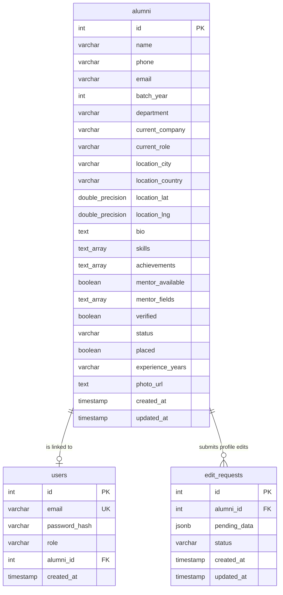

# NSCET Alumni Portal - Database Schema Document

This document defines the database schema, table structures, column constraints, and moderation data workflows for the **NSCET Alumni Portal**. The portal supports both a production **PostgreSQL** database and an offline-first **local JSON fallback** database (`server/memoryDb.json`) managed by the database adapter (`server/db.js`).

---

## 📊 Entity Relationship Diagram

---

## 💾 Table Definitions

### 1. The `alumni` Table
The primary table storing detailed records of graduates, their contact registry, current employment parameters, geographic details, and professional credentials.

| Column Name | Data Type | Constraints / Default | Description & API Privacy Behavior |
| :--- | :--- | :--- | :--- |
| `id` | `SERIAL` | `PRIMARY KEY` | Unique autoincrementing ID for each graduate. |
| `name` | `VARCHAR(255)` | `NOT NULL` | Full name of the alumnus. |
| `phone` | `VARCHAR(100)` | `NULL` | Private contact phone number (stripped in public APIs for privacy). |
| `email` | `VARCHAR(255)` | `UNIQUE NULL` | Contact email address (NIL values are stored as null). |
| `batch_year` | `INT` | `NOT NULL` | Year of graduation from the institution. |
| `department` | `VARCHAR(100)` | `NOT NULL` | Engineering department (e.g. CSE, ECE, Mech, Civil). |
| `current_company`| `VARCHAR(255)` | `NULL` | Current employer (or null if unemployed/NIL). |
| `current_role` | `VARCHAR(255)` | `NULL` | Job designation (or null if unemployed/NIL). |
| `location_city` | `VARCHAR(100)` | `NULL` | City of residence (coordinates auto-filled on update). |
| `location_country`| `VARCHAR(100)` | `DEFAULT 'India'` | Country of residence. |
| `location_lat` | `DOUBLE PRECISION`| `NULL` | Geographic latitude coordinate for map pins. |
| `location_lng` | `DOUBLE PRECISION`| `NULL` | Geographic longitude coordinate for map pins. |
| `bio` | `TEXT` | `NULL` | Professional summary biography. |
| `skills` | `TEXT[]` | `NULL` | Array of expert domains (e.g. `{'React', 'Java'}`). |
| `achievements` | `TEXT[]` | `NULL` | Array of awards or milestones. |
| `mentor_available`| `BOOLEAN` | `DEFAULT FALSE` | Flag indicating if alumnus is open to coaching students. |
| `mentor_fields` | `TEXT[]` | `NULL` | Fields of guidance (e.g. `{'Resume Review'}`). |
| `verified` | `BOOLEAN` | `DEFAULT FALSE` | Flag verifying roster details against registry logs. |
| `status` | `VARCHAR(50)` | `DEFAULT 'pending'` | Registration status (`'pending'`, `'approved'`, `'rejected'`). |
| `placed` | `BOOLEAN` | `DEFAULT FALSE` | Flag indicating if placed/employed (drives filter). |
| `experience_years`| `VARCHAR(50)` | `NULL` | Years of industry experience. |
| `photo_url` | `TEXT` | `NULL` | Profile picture endpoint or avatar. |
| `created_at` | `TIMESTAMP` | `DEFAULT CURRENT_TIMESTAMP` | Roster entry creation log. |
| `updated_at` | `TIMESTAMP` | `DEFAULT CURRENT_TIMESTAMP` | Roster entry modification log. |

---

### 2. The `users` Table
Stores login credentials and roles for portal authentication. Associates alumni sessions with their respective profile registry card.

| Column Name | Data Type | Constraints / Default | Description |
| :--- | :--- | :--- | :--- |
| `id` | `SERIAL` | `PRIMARY KEY` | Unique user account identifier. |
| `email` | `VARCHAR(255)` | `UNIQUE NOT NULL` | Login email address (admin or alumnus email). |
| `password_hash` | `VARCHAR(255)` | `NOT NULL` | Bcrypt encrypted credentials string. |
| `role` | `VARCHAR(50)` | `NOT NULL` | Session role: `'admin'` or `'alumni'`. |
| `alumni_id` | `INT` | `REFERENCES alumni(id)` | Foreign key linkage pointing back to the graduate's card. |
| `created_at` | `TIMESTAMP` | `DEFAULT CURRENT_TIMESTAMP` | User account creation log. |

---

### 3. The `edit_requests` Table
Maintains profile modification requests submitted by logged-in alumni awaiting administrator verification.

| Column Name | Data Type | Constraints / Default | Description |
| :--- | :--- | :--- | :--- |
| `id` | `SERIAL` | `PRIMARY KEY` | Unique modification request tracker. |
| `alumni_id` | `INT` | `REFERENCES alumni(id) ON DELETE CASCADE` | Link to the alumnus requesting the modification. |
| `pending_data` | `JSONB` | `NOT NULL` | JSON object containing proposed fields and values. |
| `status` | `VARCHAR(50)` | `DEFAULT 'pending'` | Verification status: `'pending'`, `'approved'`, or `'rejected'`. |
| `created_at` | `TIMESTAMP` | `DEFAULT CURRENT_TIMESTAMP` | Request submission date log. |
| `updated_at` | `TIMESTAMP` | `DEFAULT CURRENT_TIMESTAMP` | Moderation processing date log. |

---

## 🔄 Data Workflows

### Profile Modification Moderation Workflow Table

| Action | API Route | Request Body | Security Guard | Result Behavior |
| :--- | :--- | :--- | :--- | :--- |
| **Submit Edit Request** | `POST /api/alumni/edit-request` | Proposed fields JSON object | Logged-in Alumnus (`JWT`) | Inserts pending request into `edit_requests`. **Live profiles remain unchanged.** |
| **View Edit Requests** | `GET /api/admin/edit-requests` | None | Logged-in Admin (`JWT`) | Fetches all pending requests, joining alumnus metadata for side-by-side comparison. |
| **Approve Request** | `POST /api/admin/edit-requests/moderate` | `{ requestId, action: 'approve' }` | Logged-in Admin (`JWT`) | Merges proposed JSON data into `alumni` record. Sets request status to `'approved'`. |
| **Reject Request** | `POST /api/admin/edit-requests/moderate` | `{ requestId, action: 'reject' }` | Logged-in Admin (`JWT`) | Sets request status to `'rejected'`. **Live profiles remain completely unchanged.** |

---

## 🔒 Phone Number Privacy Rule
1. **Public APIs**: The endpoint `/api/alumni` queries the `alumni` table but explicitly excludes/deletes the `phone` key from all rows before returning the JSON response to guests or standard alumni sessions.
2. **Admin APIs**: The endpoint `/api/alumni/all` queries and serves the raw `phone` columns, but is strictly guarded by the `requireAdmin` middleware. If the signature verify fails, the server responds with `403 Forbidden`.
